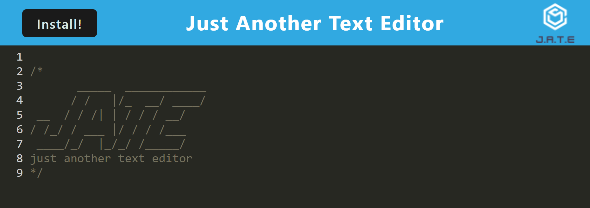

# Progressive-Web-Applications-PWA-Text-Editor
UT's Fullstack Flex Web Development Bootcamp - Challenge 20

## Description
This application is purposed with building a text editor that runs in the browser. It is a single-page application that meets the PWA criteria and features data persistence techniques that functions offline. The application is deployed to heroku.

The application allows a user to create notes or code snippets without an internet connection. When the application is installed it is downloaded on the user's computer.

## Usage

https://github.com/mayphamx/Progressive-Web-Applications-PWA-Text-Editor
